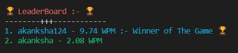

<<<<<<< HEAD
# Terminal Typing Master

Terminal Typing Master is a command-line tool designed to help you enhance your typing skills directly from your terminal window.

## Features

- *Interactive Typing Exercises*: Practice typing with interactive exercises to improve your speed and accuracy.
- *Customizable Settings*: Tailor your typing sessions by adjusting difficulty levels, choosing specific exercises, and setting time limits.
- *Progress Tracking*: Keep track of your typing progress over time to monitor improvements and identify areas for enhancement.
- *Command-line Interface*: Utilize a simple and intuitive CLI interface for seamless typing practice.

## Installation

To install Terminal Typing Master, follow these steps:

1. Clone the repository to your local machine:

    
    ```
        git clone https://github.com/Akankshabairagi55/terminal-based-typing-master.git
    ```

    
2. Navigate to the cloned directory:

    
    ```
        cd terminal-based-typing-master
    ```
    

3. Install the necessary dependencies:

    
    ```
        pip install time
        pip install random
        pip install termcolor
        pip install json
    ```   

    

## Usage

Once installed, you can launch Terminal Typing Master by running the following command:


```
    python TypingMaster.py
```


Follow the on-screen instructions to initiate typing practice sessions and improve your typing skills.

## Starting


## Results


## Leaderboard


## Contributing

We welcome contributions to Terminal Typing Master! If you would like to contribute, please follow these guidelines:

1. Fork the repository on GitHub.
2. Create a new branch from the main branch.
3. Make your desired changes.
4. Test your changes thoroughly.
5. Create a pull request with a clear description of your changes.


## Acknowledgments

We would like to express our gratitude to all contributors who have helped improve Terminal Typing Master.

## Contact

For any inquiries or support, please contact us at [bairagiakanksha55@gmail.com](mailto:bairagiakanksha55@gmail.com).
=======
# terminal-based-typing-master
Become a typing virtuoso with Terminal Typing Master! 🎩💻 This command-line tool offers a no-frills, distraction-free environment to hone your typing skills. 🚀🔤 With various difficulty levels and customizable exercises, sharpen your accuracy and speed with every keystroke. 💨⌨️ Track your progress, compete with friends, and master the art of typing efficiently—all from the comfort of your terminal. 💪🏼📈 Whether you're a beginner or aiming for mastery, Terminal Typing Master is your ultimate companion. 🌟👨🏽‍💻
>>>>>>> 3c70aa4c3bcc631dbada273f34207fa9ccaf83a3
